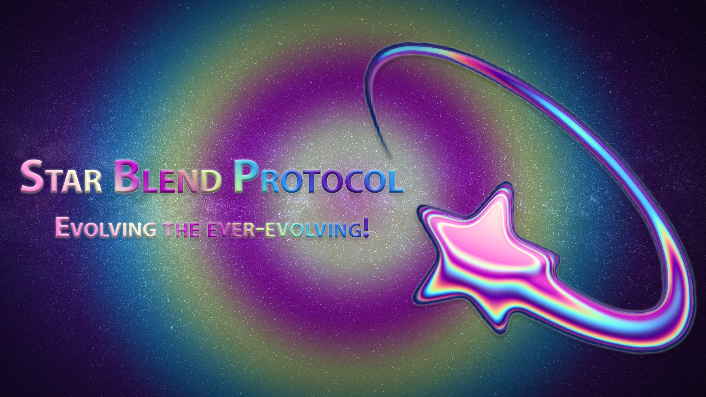

# 🌠 About Star Blend Protocol

<figure><figcaption></figcaption></figure>

**INTRODUCTION**&#x20;

In the world of blockchain technology, DeFi is gaining more traction day by day. The Binance Smart Chain has been one of the key ecosystems for accessing DeFi services and it has been the cradle of many startups and tokens. One main issue for token holders is the price volatility of their assets/cryptocurrencies due to trader's speculations. We aim to resolve this issue by creating a community-driven token that rewards its holders in BUSD (USD Dollar Token pegged on the Binance Smart Chain) with our tokenomics. Holding is incentivized and if the price drops, losses are cut as rewards have a stable value. Star Blend will be the token of our ecosystem that will provide its holders a stable passive income with the reflections of BUSD tokens.&#x20;

**TECHNOLOGY**

&#x20;Star Blend is a crypto token that relies on blockchain technology. In a general sense a blockchain is a system for storing information in such a way that it is impossible to change, hack or cheat the system. Once an information is stored inside a blockchain it is immutable and tamper-proof. This data structure is used by cryptocurrencies to store financial transaction in a reliable, secure and in some cases confidential way. The data of a blockchain are encrypted and stored in a decentralized manner in many different computers (called nodes) making it robust to various type of attack.

&#x20;**Binance Smart Chain and BEP20 tokens**&#x20;

The Binance Smart Chain (BSC) is a high-performance blockchain, with smart contract programmability, that aims to tackle the blockchain society's scaling issues. It has been developed by the Binance exchange. Binance, is one of the leading cryptocurrency centralized exchanges. One of the main features of the BSC network is the possibility to run smart contracts: self-executing contract where the terms of the agreement between buyer and seller are directly written into lines of code. Their functions and transactions are trackable and irreversible, moreover, it is possible to renounce the ownership of the token's contract making it fully decentralized and unchangeable. Smart contracts permit trusted transactions and agreements to be carried out among disparate, anonymous parties without the need for a central authority, legal system, or external enforcement mechanism.

**STABILITY - COMMITMENT**

&#x20;Price volatility has been one of the main drawbacks for new investors in the crypto world. For this reason, we built a token that can provide each holder the safety of gaining a stable passive income while remaining invested into cryptocurrencies. We believe in long term safe investments and wants our holders to do the same. Also, we don't want power to be centralized, therefore, we are once our platform is available, we will be renouncing the contract and we have implemented anti-whale mechanisms to prevent money centralization and help the token price stability.&#x20;

**COMMUNITY**

&#x20;We aim to create a decentralize and trusted community, fully committed on mutual help and passionate about cryptocurrencies. We also want to educate people on how to move inside the DeFi revolution, leaving no one out, no matter their backgrounds.

**CREATIVITY**

&#x20;As we love art, we will endorse all of our community artworks by providing a NFT marketplace where people will be able to create their own NFT on Star Blend or if they so choose, we will be offering a white label service to develop their own marketplace. We will also create our own special “Star Blend” collection.

**USER FRIENDLY**&#x20;

We strive to provide ease of use in the crypto space and easy access to all our services through simple and intuitive platforms that can help beginners join DeFi. Our team will actively work to provide such platforms.

**DASHBOARD**&#x20;

SBP holders are rewarded in BUSD every 60 minutes automatically. There is no claiming required (you can claim manually at any time). Users can track their rewards and more on our dashboard.

**STAKING**&#x20;

Users will be able to stake their Star Blend tokens for additional rewards. No need to stake our NFT collection as just for holding you will earn Star Blend tokens every hour.

**NFT Marketplace**&#x20;

Our planned NFT Marketplace will span across multiple blockchains and will allow users to buy and sell NFTs as well as create their own. The marketplace will be easy to use and have low fees.&#x20;

**LAUNCH PAD**&#x20;

Our planned launchpad will also span across multiple blockchains like our NFT Marketplace and will allow users to do a number of things including:

• Token and LP locking&#x20;

• Token vesting&#x20;

• Token creation&#x20;

• Token bulk-send
